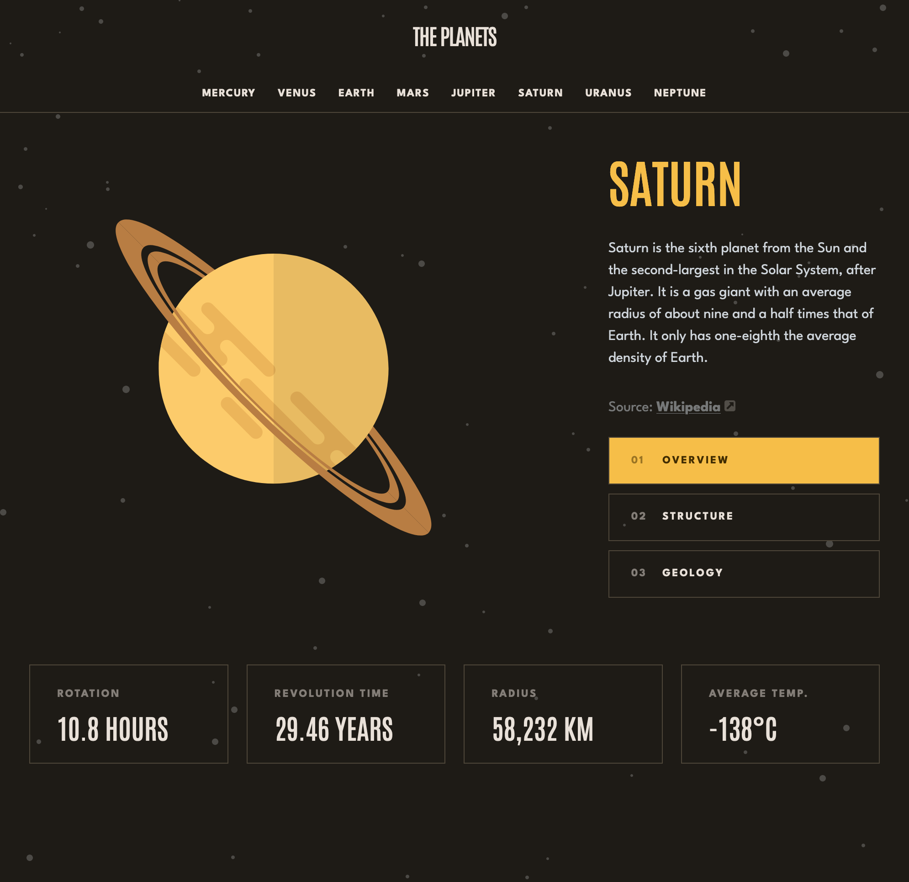

# Frontend Mentor - Planets fact site solution

This is a solution to the [Planets fact site challenge on Frontend Mentor](https://www.frontendmentor.io/challenges/planets-fact-site-gazqN8w_f). Frontend Mentor challenges help you improve your coding skills by building realistic projects. 

## Table of contents

- [Overview](#overview)
  - [The challenge](#the-challenge)
  - [Screenshot](#screenshot)
  - [Links](#links)
- [My process](#my-process)
  - [Built with](#built-with)
  - [What I learned](#what-i-learned)
  - [Continued development](#continued-development)
  - [Useful resources](#useful-resources)
- [Author](#author)
- [Acknowledgments](#acknowledgments)

## Overview

### The challenge

Users should be able to:

- View the optimal layout for the app depending on their device's screen size
- See hover states for all interactive elements on the page
- View each planet page and toggle between "Overview", "Internal Structure", and "Surface Geology"

### Screenshot

### Links

- Solution URL: [Add solution URL here](https://www.frontendmentor.io/solutions/planets-facts-using-sveltekit-and-material-design-2obFNf3NiS)
- Live Site URL: [Add live site URL here](https://astounding-biscotti-8d05ed.netlify.app)

## My process

### Built with

- [SvelteKit](https://kit.svelte.dev/)
- [Material Theme Builder](https://m3.material.io/theme-builder#/custom) – supporting dark and light mode.
- [Open Props](https://open-props.style/)

### What is missing

- Check for a11y 
- Small animations
- Testing e.g. with Playwright
